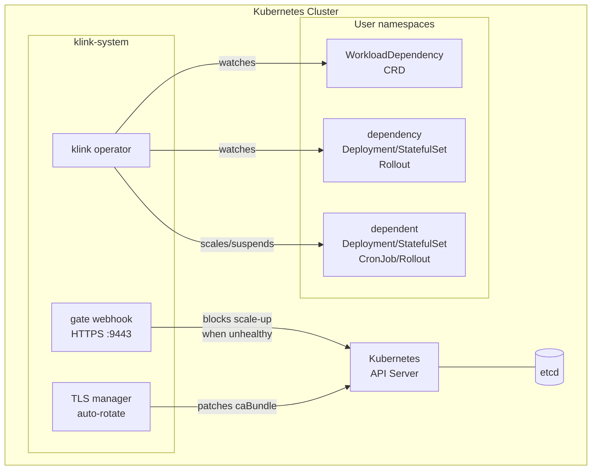
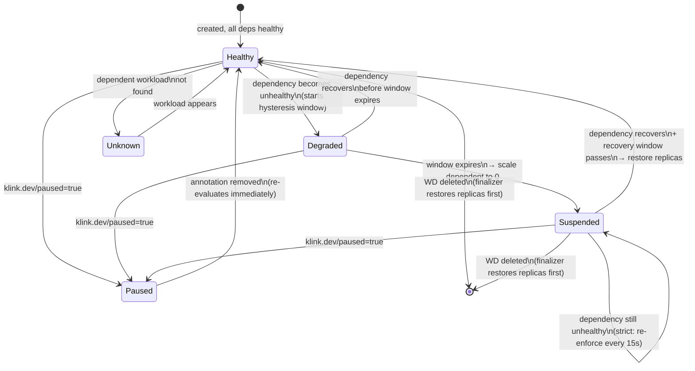
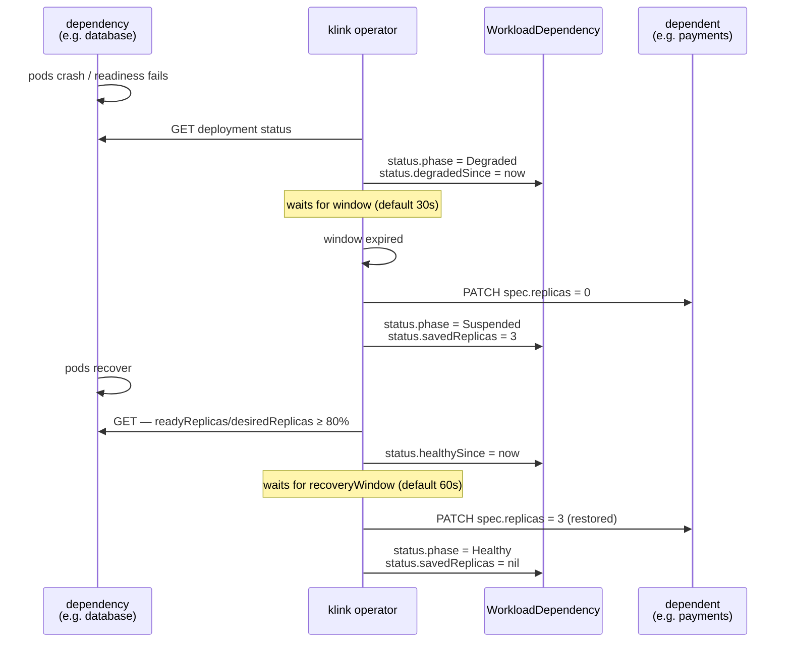
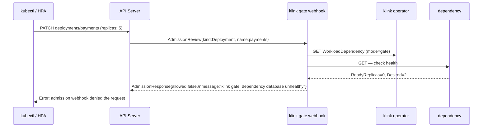
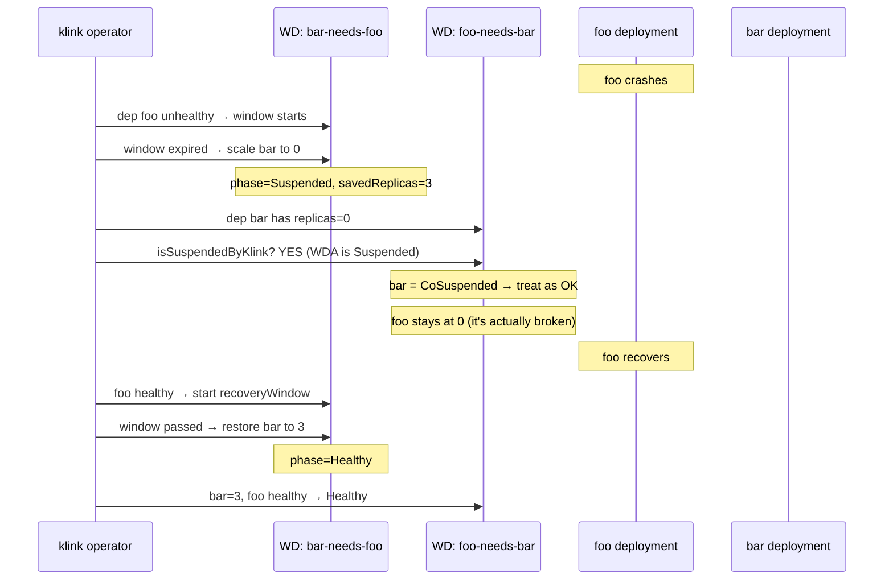
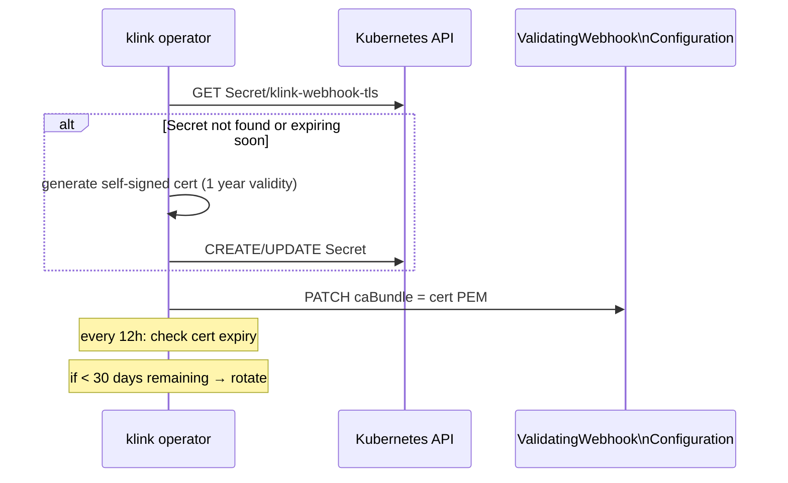

# Architecture

## Overview

klink is a Kubernetes operator that manages dependency relationships between workloads. When a dependency becomes unhealthy, klink automatically suspends dependent workloads and restores them when the dependency recovers.

## Reconciliation State Machine

Each `WorkloadDependency` transitions through these phases:

## Scale-to-Zero Sequence

What happens when a dependency fails:

## Gate Mode — Blocking Scale-Up

## Mutual Dependency — CoSuspended Resolution

Prevents A→B + B→A deadlock:

## TLS Certificate Lifecycle

