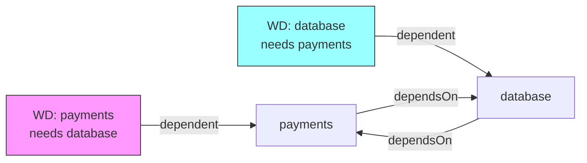
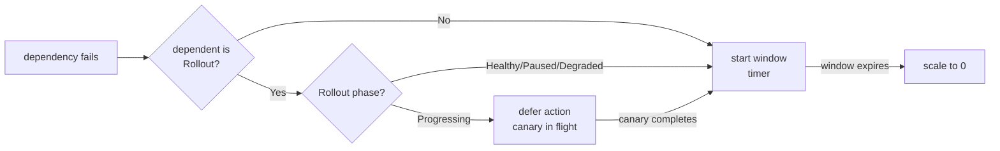

# Core Concepts

## WorkloadDependency

A `WorkloadDependency` resource declares that one workload (the *dependent*) depends on one or more other workloads (the *dependencies*). klink continuously monitors the dependencies and acts when they become unhealthy.

```
WorkloadDependency
├── spec.dependent         — workload that gets suspended when deps fail
├── spec.dependsOn[]       — list of workloads to monitor
│   └── condition          — health thresholds and timing windows
├── spec.onDegraded        — what to do (ScaleToZero)
└── spec.mode              — how strictly to enforce (strict/soft/gate)
```

## Health Check

klink considers a dependency **healthy** when:

| Workload type | Healthy if |
|---------------|-----------|
| Deployment | `readyReplicas / desiredReplicas × 100 ≥ minReadyPercent` |
| StatefulSet | same formula |
| Rollout (Argo) | `status.phase` is `Healthy`, `Progressing`, or `Paused` |

`Progressing` is treated as healthy because the stable version is still serving traffic during a canary rollout.

### minReadyPercent

```yaml
condition:
  minReadyPercent: 80   # healthy if 80%+ pods are ready (default: 100)
```

Useful when you want to tolerate a few pod restarts without triggering cascade shutdown.

## Hysteresis and Recovery Windows

Without windows, a single pod restart would trigger scale-to-zero. Windows prevent flapping:

```
Timeline:

dependency health:  ████░░░░░░░░████████████░░░░█████████████████
                         ↑                   ↑
                    starts failing       recovers

klink tracking:          │◄── window ──►│    │◄── recoveryWindow ──►│
                         30s             ↓    60s                    ↓
action:                           scale to 0                  restore replicas
```

```mermaid
gantt
    title Dependency failure → scale-to-zero → recovery
    dateFormat  s
    axisFormat  %Ss

    section dependency health
    Healthy           : 0, 10s
    Unhealthy         : 10s, 50s
    Healthy again     : 60s, 120s

    section klink action
    Watching (Degraded) : crit, 10s, 40s
    Scale to zero        : milestone, 40s, 0
    Waiting (Suspended) : 60s, 120s
    Restore replicas    : milestone, 120s, 0
```

## Enforcement Modes

| Mode | When dependency fails | When manually scaled up (while suspended) |
|------|----------------------|------------------------------------------|
| `strict` (default) | Scales dependent to 0 after window | Reverts to 0 within 15s — klink always wins |
| `soft` | Scales to 0 once | Ignores — lets manual override stand |
| `gate` | Does NOT scale to 0 | Blocks the scale-up via admission webhook |

### When to use each mode

**strict** — Default. Production services where you want guaranteed cascade behavior. Works on all cluster types.

**soft** — When operators need to manually intervene during incidents without klink fighting them.

**gate** — When you want to prevent scaling a service to non-zero while its dependency is down, but don't want klink to actively scale it down (e.g., it's already at 0 because of another reason). Requires admission webhook support (not available on GKE Autopilot).

## Pause

Temporarily disable all enforcement without deleting the resource:

```bash
# Pause
kubectl annotate workloaddependency my-wd klink.dev/paused=true

# Resume (remove annotation)
kubectl annotate workloaddependency my-wd klink.dev/paused-
```

Phase becomes `Paused`. When annotation is removed, klink re-evaluates immediately.

## Mutual Dependencies

klink handles `A→B` and `B→A` without deadlock using the **CoSuspended** mechanism:

When klink scales a workload to zero, it marks it internally as "suspended by klink". Other WDs that depend on this workload see it as `CoSuspended` (not a real failure) and don't cascade.



**Recovery**: when you manually restore one service, klink automatically restores the other.

## Rollout (Argo) Support

For Argo Rollouts, klink adds special handling for canary deployments:



**Why defer during Progressing?** A canary rollout means a new version is actively being tested. Interrupting it by scaling to zero would:
1. Break the canary analysis
2. Take down the stable version too
3. Require manual intervention to restart the rollout

## Finalizer

klink adds a finalizer (`klink.dev/finalizer`) to every `WorkloadDependency`. This ensures that if you delete a WD while its dependent is at 0 replicas, klink restores the replicas before allowing the deletion to complete.

Without the finalizer, deleting a WD would leave workloads permanently scaled to zero.
